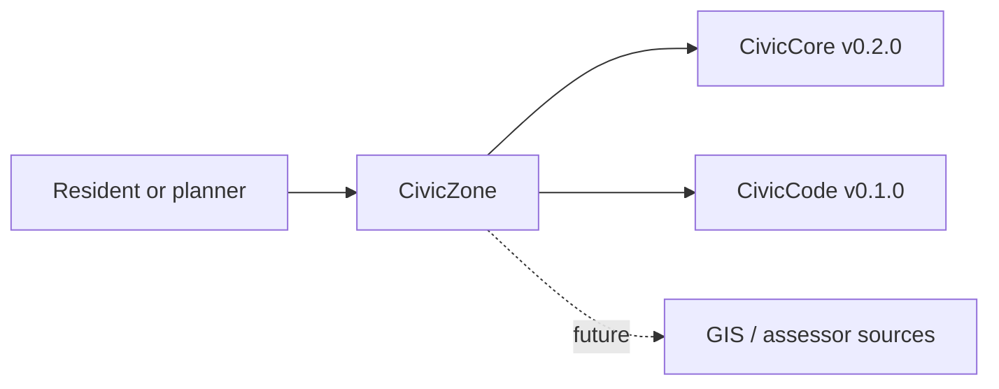

# CivicZone User Manual

## For Residents And Municipal Decision-Makers

CivicZone is planned to answer routine parcel-aware zoning questions with citations. It is not a zoning determination tool, not legal advice, and not a replacement for planner review.

Current state: `0.1.0.dev0` parcel lookup foundation exists in development. The package, health endpoints, canonical zoning schema, Alembic migrations, and a sample parcel/zone lookup API exist. Zoning answers, live GIS import, and public workflow screens are not implemented yet.

## For IT And Technical Staff

CivicZone is a FastAPI Python package pinned to `civiccore==0.2.0`. The current runtime exposes:

- `GET /`
- `GET /health`
- Canonical SQLAlchemy models for zones, overlays, parcels, use rules, dimensional rules, citations, precedents, interpretation notes, and zone questions.
- Alembic migration `civiczone_0001_schema`.
- `POST /api/v1/civiczone/parcels/lookup` for sample parcel lookup.

Run local verification with:

```powershell
python -m pip install -e ".[dev]"
python -m pytest -q
bash scripts/verify-release.sh
```

## Architecture



CivicZone depends on CivicCore and CivicCode. CivicCore does not depend on CivicZone.
